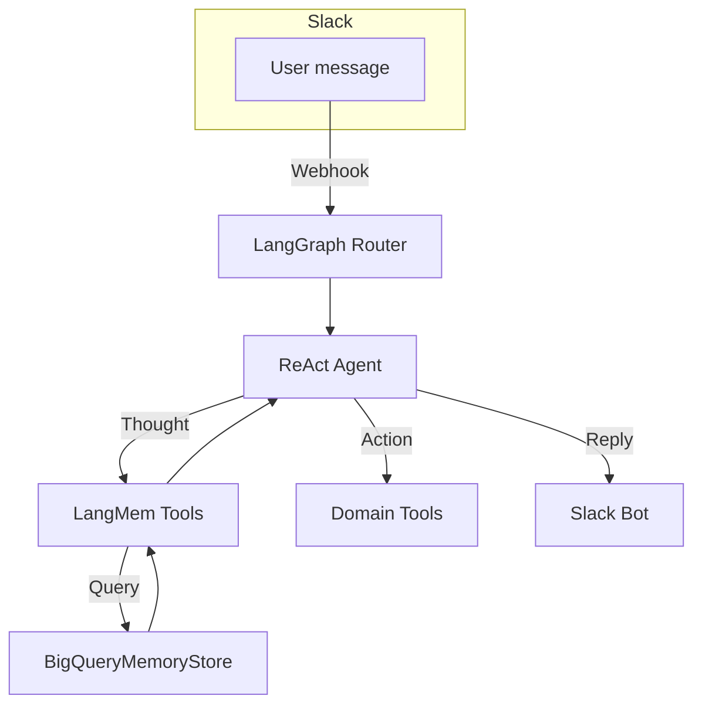

# baby‑NICER

*A memory‑first, LangGraph‑powered agent that lives inside Slack and grows alongside your team.*

---

## Why baby‑NICER?

Modern teams need more than a chatbot. They need a teammate that **remembers**—one that can surface past decisions, reuse proven workflows, and keep context alive across channels, threads and months. baby‑NICER ("Nimble Impartial Consensus Engendering Resource – beta") is our open‑source prototype of that vision.

- **Agentic core.** Built on LangGraph’s ReAct agent pattern for autonomous reasoning + tool use.
- **Three‑tier memory.** Semantic (facts), episodic (experiences) and procedural (skills) stores, powered by LangMem.
- **Cloud‑scale recall.** BigQueryMemoryStore persists millions of vector‑indexed memories with millisecond search.
- **Swarm‑ready.** Designed to spawn specialist agents—a SQL analyst, a Superset chart‑maker, a social‑listening scout—under a LangGraph Swarm.
- **Positive ethics.** Granular BigQuery IAM, opt‑in retention and audit hooks so memory empowers people rather than surveils them.

---

## Architecture



- **LangGraph ReAct Agent** – parses "Thought → Action" traces.
- **LangMem Tools** – `manage_*` & `search_*` for semantic, episodic, procedural stores.
- **BigQueryMemoryStore** – async, batched backend for LangMem using BigQuery `VECTOR_SEARCH`.
- **Domain Tools** – anything your team needs (dbt, Superset, GitHub, JIRA, etc.).

---

## Quick Start

```bash
# 1. clone & install
$ git clone https://github.com/johannescastner/baby-NICER.git
$ cd baby-NICER
$ pip install -e .[dev]

# 2. set env vars (example shown for bash)
export SLACK_BOT_TOKEN="xoxb‑****"
export SLACK_SIGNING_SECRET="****"
export OPENAI_API_KEY="sk‑****"   # or another LLM provider
export GCP_PROJECT="my‑gcp‑project"
export BQ_DATASET="nicer_memory"

# 3. initialise BigQuery tables
$ python scripts/init_bigquery.py  # creates three tables & vector index

# 4. run the bot locally
$ uvicorn baby_nicer.app:app --reload
```

Full documentation lives in `docs/`.

---

## Configuration

| Variable              | Description                                   |
| --------------------- | --------------------------------------------- |
| `EMBEDDING_MODEL`     | sentence‑transformers name or OpenAI model id |
| `MEMORY_TABLE_SUFFIX` | customise table names per environment         |
| `MAX_EPISODE_TOKENS`  | truncate long episodes before embedding       |
| `SWARM_ENABLED`       | `true/false` – toggle multi‑agent mode        |

See `config/default.yaml` for all knobs.

---

## Roadmap

- **Q2 2025** – SQL/​dbt agent, Apache Superset agent
- **Q3 2025** – Swarm supervisor + social‑listening scout
- **Q4 2025** – Habermas mediator & interactive memory dashboard

Community PRs welcome on any milestone 🚀

---

## Contributing

1. Fork → create feature branch → commit → open PR.
2. Run `pre‑commit` and `pytest` locally. CI must pass.
3. For new tools, add docstrings + update `docs/tools.md`.

We follow the [Contributor Covenant](https://contributor-covenant.org/version/2/1/code_of_conduct/) – be excellent to each other.

---

## Support & Contact

- **Companies** – want a bespoke deployment? Email [johannes@towardspeople.co.uk](mailto\:johannes@towardspeople.co.uk)\*\*.
- **Developers / Researchers** – join the discussion on [GitHub Issues](https://github.com/johannescastner/baby-NICER/issues) or ping [@towards-people.bsky.social]([@towards-people.bsky.social](https://bsky.app/profile/towards-people.bsky.social).

---

## Licence

Apache 2.0 – free to use, fork and modify. Please retain the copyright notice and link back to this repo.

